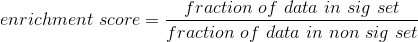

###############
Enrich p-values
###############

A simple script to compare p-values between a test and comparison dataset at a
variety of p-value cutoffs. By plotting the enrichment score at a variety of
cutoffs, it is possible to pick the optimal cutoff for your data.

Version: 1.0-beta1

.. contents:: **Contents**

Algorithm
=========

For each p-value in the interval between ``max_pval`` (default: 0.05) and
``min_pval`` (default: 1e-15), we test at intervals of 1 and 5 for each order of
magnitute, e.g. 0.05, 0.01, 0.005, 0.001, 5e-4, 1e-4, 5e-5, 1e-6, ... 1e-15.

To test, we simply take all identities with a p-value less than the cutoff and
compare them to all identities in the comparison set with p-values below the
``comp_set_pvalue``. We simply ask what percentage or the test set are in the
comparison set. We then do exactly the same with the entire set of identities in
the comparison set that have a p-value greater than 0.98.

The identities are generally going to be gene or SNP names, but they can be
anything (e.g. coordinates) as long as they overlap in the test and comparison
data.

Installation
============

Install via PyPI:

.. code:: shell

    pip install enrich_pvalues

Or install from github:

.. code:: shell

    pip install https://github.com/TheFraserLab/enrich_pvalues/tarball/master

It should work with python 2 or 3, but python 3 is recommended.

Requirements
------------

In ``requirements.txt``.

Usage
=====

ToDo
